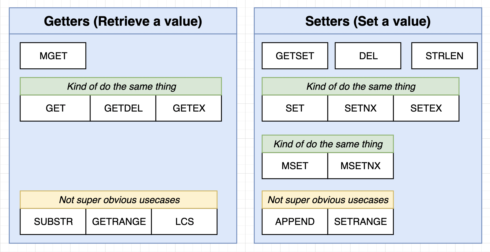
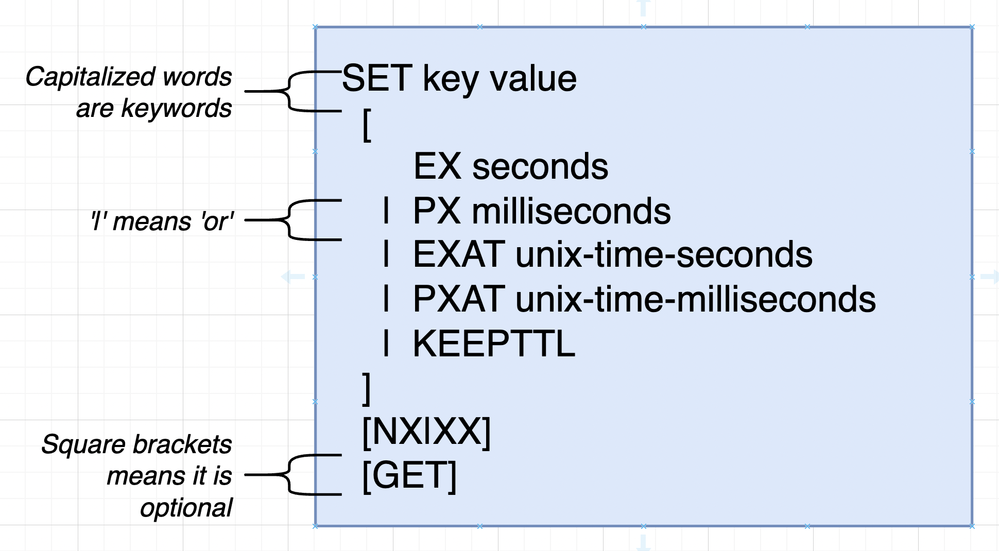

### Always refer to redis documentation for commands

```
https://redis.io/commands/
```

# Commands used for setting and retrieving _String Data_



# Variations of SET:



1. **_EX_** is used for setting when our data will expire.
2. **_XX_** is used for setting value to key only if key is present in cache already.

```
SET colour 'red' XX
```

👆This will first check if key is present in cache or redis.
if(present) then colour will be set to red and returned null.
else colour will not be set and null will be returned.

3. **_NX_** is exactly opposite of XX. If key is already present then value will not be set.

```
SET colour 'red' NX
```

👆Value will not be sent to red if colour key is already preset.

#### 4. Expire in SET:

a. EX : (Automatically deletes in seconds)

```
SET COLOR 'Blue' EX 4
```

👆 This will set colour variable = Blue for 4 seconds
